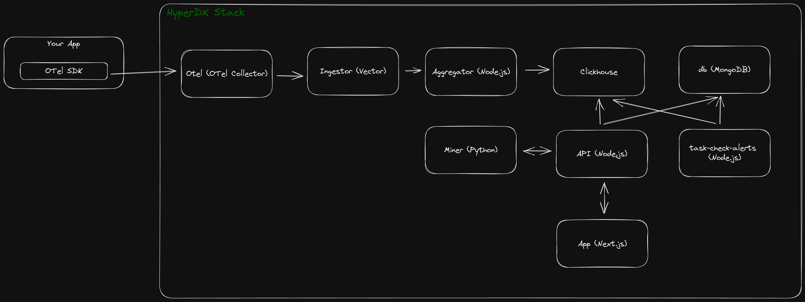

# Contributing

## Architecture Overview



Service Descriptions:

- OpenTelemetry Collector (otel-collector): Receives OpenTelemetry data from
  instrumented applications and forwards it to ClickHouse for storage. Includes
  OpAMP supervisor that dynamically pulls configuration from HyperDX API.
- ClickHouse (ch-server): ClickHouse database, stores all telemetry.
- MongoDB (db): Stores user/saved search/alert/dashboard data.
- HyperDX API (api): Node.js API, executes ClickHouse queries on behalf of the
  frontend and serves the frontend. serves the frontend. Can also run alert
  checker.
- HyperDX UI (app): Next.js frontend, serves the UI.

## Development

Pre-requisites:

- Docker
- Node.js (`>=22`)
- Yarn (v4)

You can get started by deploying a complete development stack in dev mode.

```bash
yarn dev
```

This will start the Node.js API, Next.js frontend locally and the OpenTelemetry
collector and ClickHouse server in Docker.

Each worktree automatically gets unique ports so multiple developers (or agents)
can run `yarn dev` simultaneously without conflicts. A dev portal at
http://localhost:9900 auto-starts and shows all running stacks with their
assigned ports. Check the portal to find the URL for your instance.

To stop the stack:

```bash
yarn dev:down
```

To enable self-instrumentation and demo logs, you can set the `HYPERDX_API_KEY`
to your ingestion key (visit the Team settings page after creating your account).

To do this, create a `.env.local` file in the root of the project and add the
following:

```sh
HYPERDX_API_KEY=<YOUR_INGESTION_API_KEY_HERE>
```

Then restart the stack using `yarn dev`.

The core services are all hot-reloaded, so you can make changes to the code and
see them reflected in real-time.

### Volumes

The development stack mounts volumes locally for persisting storage under
`.volumes`. Each worktree gets its own volume directory (e.g.
`.volumes/ch_data_dev_89`). Clear the `.volumes` directory to reset ClickHouse
and MongoDB storage.

### Windows

If you are running WSL 2, Hot module reload on Nextjs (Frontend) does not work
out of the box on windows when run natively on docker. The fix here is to open
project directory in WSL and run the above docker compose commands directly in
WSL. Note that the project directory should not be under /mnt/c/ directory. You
can clone the git repo in /home/{username} for example.

To develop from WSL, follow instructions
[here](https://code.visualstudio.com/docs/remote/wsl).

## Testing

All test environments use slot-based port isolation, so they can run
simultaneously with the dev stack and across multiple worktrees.

### E2E Tests

E2E tests run against a full local stack (MongoDB + ClickHouse + API). Docker
must be running.

```bash
# Run all E2E tests
make e2e

# Run a specific spec file (dev mode: hot reload, containers kept running)
make dev-e2e FILE=search

# Run with grep pattern
make dev-e2e FILE=search GREP="filter"

# Run via script directly for more control
./scripts/test-e2e.sh --ui --last-failed
```

Tests live in `packages/app/tests/e2e/`. Page objects are in `page-objects/`,
shared components in `components/`.

### Integration Tests

```bash
# Build dependencies (run once before first test run)
make dev-int-build

# Run a specific test file
make dev-int FILE=checkAlerts
```

### Unit Tests

To run unit tests or update snapshots, you can go to the package you want (ex.
common-utils) to test and run:

```bash
yarn dev:unit
```

## AI-Assisted Development

The repo ships with configuration for AI coding assistants that enables interactive browser-based E2E test generation and debugging via the [Playwright MCP server](https://github.com/microsoft/playwright-mcp).

### Claude Code

The project includes agents and skills for test generation, healing, and planning under `.claude/`. These are loaded automatically when you open the project in Claude Code. No additional setup required.

### Cursor

A Playwright MCP server config is included at `.cursor/mcp.json`. To activate it:

1. Open **Cursor Settings → Tools & MCP**
2. The `playwright-test` server should appear automatically from the project config
3. Enable it

This gives Cursor's AI access to a live browser for test exploration and debugging.

## Additional support

If you need help getting started,
[join our Discord](https://discord.gg/FErRRKU78j) and we're more than happy to
get you set up!
