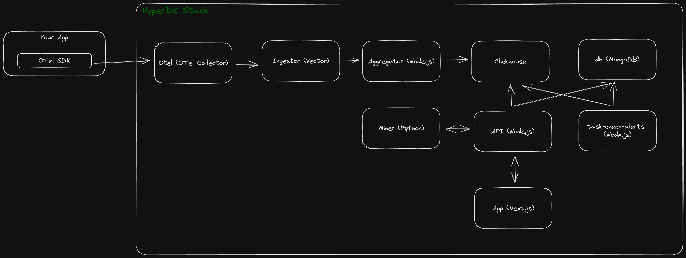

# Contributing

## Getting vouched

Issues, bug reports and discussion are open to everyone. Pull requests are a
little different: a maintainer has to vouch for you before we review your first
one.

**Your first pull request is how you get vouched.** There's no separate request
to file and nothing to do up front. Pick an issue, write the change, and open
the PR. A bot adds a `needs-vouch` label and a comment; a maintainer looks at
the PR, and if it's a real attempt at the problem they comment `/vouch` on it
and review it from there. Nothing gets closed while you wait.

Please don't open an issue just to ask to be vouched. We vouch for people based
on a contribution, not an introduction, and requests without a PR attached get
closed. If you want a steer before writing code, ask on the issue you plan to
fix or on [Discord](https://discord.gg/FErRRKU78j).

**One at a time.** Outside contributors can have one pull request open at once,
or three once vouched. Open more than that and the newest is closed with a note
asking you to finish the others first; reopen it once one of them lands. Drafts
don't count towards the limit. This isn't about the quality of your work — a
handful of parallel changes from one author is more than we can review properly,
and in practice it means none of them get merged.

What makes a first PR easy to vouch for: it references an `Accepting PR` issue,
explains why the change is needed, includes [reproduction
steps](#reproducing-issues-and-prs), and has [before/after
screenshots](#ui-changes-need-beforeafter-screenshots) if it touches the UI.

Good places to start: the [good first
issue](https://github.com/hyperdxio/hyperdx/labels/good%20first%20issue) label,
and [Discord](https://discord.gg/FErRRKU78j) if the dev setup gives you trouble.

Why we do this: AI tools make it cheap to open a plausible-looking PR with no
understanding behind it, and reviewing those crowds out the contributions we
want to spend time on. Vouching is a check that there's a person behind the
work, not a skill test. We use [Vouch](https://github.com/mitchellh/vouch); the
list is [`.github/VOUCHED.td`](./.github/VOUCHED.td).

### Vouching someone (maintainers)

Vouch from the contributor's open pull request, once you've looked at it and
it's a genuine attempt at the problem. Don't vouch from an issue that has no PR
behind it; point the author here instead.

Comment with the keyword first on the first line:

```
/vouch @username optional reason
/unvouch @username
/denounce @username optional reason
```

On a PR, a bare `/vouch` with no handle vouches that PR's author.

`/denounce` closes a PR outright and keeps closing that author's PRs from then
on. Keep it for repeat spam and bad-faith behaviour; `/unvouch` quietly removes
someone without blocking them.

Vouching also lifts someone's open-PR allowance from one to three, which is the
only way to let a contributor run more than one at a time. Reopening a PR that
was closed for hitting the cap won't work on its own — the check runs again on
reopen and closes it again.

The bot opens a PR updating `.github/VOUCHED.td`. **Nothing takes effect until
you merge it.** That PR needs an approval rather than a green CI run — GitHub
does not run workflows on PRs the bot creates. Merge them one at a time; two
open at once will conflict on the same sorted list.

## From issue to pull request

New bug reports and feature requests open with a `Needs Feedback` label (the
issue templates apply it automatically). That label means the issue is still
being discussed — the scope, the approach, or whether we want the change at all
isn't settled yet. **Please don't start a PR against a `Needs Feedback`
issue**; the discussion often changes what the fix should be, and code written
too early tends to get thrown away.

Once a maintainer is happy with the direction, they swap `Needs Feedback` for
`Accepting PR`. That's the green light: the issue is understood and ready for
someone to pick up. Comment to claim it so two people don't duplicate work, then
open your PR and reference the issue (e.g. `Closes #123`).

If an issue you care about is stuck in `Needs Feedback`, add the missing detail
(a clear repro, the debug info from Help → Copy debug info, your use case) or
ask on the issue — that's usually what unblocks it. This is a convention, not a
hard gate: it keeps effort pointed at changes we've agreed on, on top of the
vouching trust check above.

## Reproducing issues and PRs

Every bug report and every PR needs steps someone else can follow to see the
problem (or the fix) for themselves. If a maintainer can't reproduce it, they
can't triage the issue or review the PR.

**Try the demo environment first.** [play.hyperdx.io](https://play.hyperdx.io)
is a hosted HyperDX connected to a public demo dataset (logs, traces, metrics
and session replays from the OpenTelemetry demo app). If your bug shows up
there, link the exact URL — search and chart explorer keep their query, filters
and time range in the URL — and that's most of the repro.

**If it needs your own setup, reproduce it locally against the demo data.** The
quickest way is the frontend in local mode, which needs no Docker and no
account:

1. Run `yarn app:dev:local` and open the app URL it prints.
2. On the onboarding screen, click **Connect to Demo Server**. This adds a
   `Demo` connection and the Demo Logs, Traces, Metrics and Sessions sources,
   the same data play.hyperdx.io uses. Connections and sources live in your
   browser's local storage; clear site data to start over.
3. Follow your steps from there.

This is the same mode the Vercel preview on your PR runs in, so reviewers can
follow the same steps there.

Local mode has no API behind it (dashboards and saved searches are kept in local
storage), so it can't reproduce anything involving alerts, webhooks, auth,
teams, or the API itself. For those, use the full stack (`yarn dev`, see
[Development](#development)). It sets up a `Local ClickHouse` connection and
sources for every new team, so onboarding skips the demo server button. To
point it at the demo data instead, add a connection in **Team Settings** with
host `https://sql-clickhouse.clickhouse.com`, user `otel_demo`, and an empty
password, then add sources on it from database `otel_v2` (tables `otel_logs`,
`otel_traces`, `hyperdx_sessions`, and the `otel_metrics_*` tables). Otherwise
it only has the data your local stack sends to itself (see `HYPERDX_API_KEY`
under [Development](#development)).

If the bug depends on your own schema or data, say so, and include the table
definition (`SHOW CREATE TABLE ...`) and the source settings. Strip anything
sensitive.

**What good steps look like:**

- Start from a known place: play.hyperdx.io, `yarn app:dev:local` connected to
  the demo server, or a fresh `yarn dev` (say which).
- Number each step and name the UI element you interact with by its visible
  text: "Open **Search**, pick the **Demo Logs** source, set the time range to
  **Last 15 minutes**, type `SeverityText:error` and press Enter."
- End with what you expected and what happened instead.
- For bugs, add the debug info from **Help → Copy debug info**.

**In a PR**, fill in the "How to reproduce" section of the template with:

- Steps that show the bug or missing behavior on `main` (or a link to the issue
  that has them).
- The same steps on your branch, and what's different now.
- Anything extra the reviewer needs: env vars, a feature flag, a particular
  source or schema, seed data.

## UI changes need before/after screenshots

Any PR that changes something a user can see in the app must include before and
after screenshots, or a short video if the change involves interaction or
animation. Put them in the "Screenshots or video" table of the PR template.

- **Before** is `main`; **after** is your branch. Take both at the same
  viewport size and theme, showing the same screen and data, so the difference
  is obvious. The demo server data makes this easy.
- For a brand new screen or component there's no "before"; show the place it's
  reached from instead.
- If the change affects both light and dark mode, or both the HyperDX and
  ClickStack themes, include each one that looks different.
- Keep them focused. Crop to the area that changed, or annotate the full page.

This isn't enforced by a check, but reviewers won't start on a UI PR without
them.

## Architecture Overview



Service Descriptions:

- OpenTelemetry Collector (otel-collector): Receives OpenTelemetry data from
  instrumented applications and forwards it to ClickHouse for storage. Includes
  OpAMP supervisor that dynamically pulls configuration from HyperDX API.
- ClickHouse (ch-server): ClickHouse database, stores all telemetry.
- MongoDB (db): Stores user/saved search/alert/dashboard data.
- HyperDX API (api): Node.js API, executes ClickHouse queries on behalf of the
  frontend and serves the frontend. serves the frontend. Can also run alert
  checker.
- HyperDX UI (app): Next.js frontend, serves the UI.

## Development

Pre-requisites:

- Docker
- Node.js (`>=22`)
- Yarn (v4)

You can get started by deploying a complete development stack in dev mode.

```bash
yarn dev
```

This will start the Node.js API, Next.js frontend locally and the OpenTelemetry
collector and ClickHouse server in Docker.

Each worktree automatically gets unique ports so multiple developers (or agents)
can run `yarn dev` simultaneously without conflicts. A dev portal at
http://localhost:9900 auto-starts and shows all running stacks with their
assigned ports. Check the portal to find the URL for your instance.

To stop the stack:

```bash
yarn dev:down
```

To enable self-instrumentation and demo logs, you can set the `HYPERDX_API_KEY`
to your ingestion key (visit the Team settings page after creating your account).

To do this, create a `.env.local` file in the root of the project and add the
following:

```sh
HYPERDX_API_KEY=<YOUR_INGESTION_API_KEY_HERE>
```

Then restart the stack using `yarn dev`.

The core services are all hot-reloaded, so you can make changes to the code and
see them reflected in real-time.

### Volumes

The development stack mounts volumes locally for persisting storage under
`.volumes`. Each worktree gets its own volume directory (e.g.
`.volumes/ch_data_dev_89`). Clear the `.volumes` directory to reset ClickHouse
and MongoDB storage.

### Windows

If you are running WSL 2, Hot module reload on Nextjs (Frontend) does not work
out of the box on windows when run natively on docker. The fix here is to open
project directory in WSL and run the above docker compose commands directly in
WSL. Note that the project directory should not be under /mnt/c/ directory. You
can clone the git repo in /home/{username} for example.

To develop from WSL, follow instructions
[here](https://code.visualstudio.com/docs/remote/wsl).

## Testing

All test environments use slot-based port isolation, so they can run
simultaneously with the dev stack and across multiple worktrees.

### E2E Tests

E2E tests run against a full local stack (MongoDB + ClickHouse + API). Docker
must be running.

```bash
# Run all E2E tests
make e2e

# Run a specific spec file (dev mode: hot reload, containers kept running)
make dev-e2e FILE=search

# Run with grep pattern
make dev-e2e FILE=search GREP="filter"

# Run via script directly for more control
./scripts/test-e2e.sh --ui --last-failed
```

Tests live in `packages/app/tests/e2e/`. Page objects are in `page-objects/`,
shared components in `components/`.

### Integration Tests

```bash
# Build dependencies (run once before first test run)
make dev-int-build

# Run a specific test file
make dev-int FILE=checkAlerts
```

### Unit Tests

To run unit tests or update snapshots, you can go to the package you want (ex.
common-utils) to test and run:

```bash
yarn dev:unit
```

### Mutation Tests

Coverage tells you a line ran; it doesn't tell you a test would fail if that
line were wrong. [Stryker](https://stryker-mutator.io/) edits the source in
small ways (flips a comparison, empties a return) and reports which edits the
test suite failed to catch. A surviving mutant is a missing assertion.

Set up in `common-utils` only for now. From `packages/common-utils`:

```bash
# The file you're working on — seconds to a couple of minutes
yarn dev:mutation --mutate src/filters.ts

# Everything you've changed off main
yarn dev:mutation --mutate "$(git diff --name-only --diff-filter=d --relative origin/main... -- 'src/**/*.ts' | grep -v __tests__ | paste -sd, -)"

# The whole package (slow — tens of minutes)
yarn dev:mutation
```

Scope it to what you're working on. Runs are roughly linear in mutants, and the
whole package is ~365 files. Results are cached between runs, so a re-run after
editing one file only re-tests that file.

Read the `Survived` entries: each one shows the edit that was made and the tests
that ran anyway. `NoCoverage` means no unit test reaches that code at all — some
of those are covered by integration tests, which this doesn't run. An HTML
report lands in `reports/mutation/`.

The score is not a coverage number for the whole file. Module-level code —
constants, regexes, lookup tables — isn't mutated at all (`ignoreStatic`, about
10% of the mutants here) and is left out of the denominator, so a high score
says nothing about whether those are asserted on.

Not wired into CI. It's a tool for while you're writing tests, not a gate.

One wrinkle worth knowing about: the root `package.json` pins
`@stryker-mutator/core/minimatch` to `^9`. Our blanket `brace-expansion`
resolution forces v2 (CJS) everywhere, and minimatch v10's ESM build needs
`brace-expansion` v5's named exports, so Stryker crashes on startup without the
pin. Drop it if that blanket resolution is ever narrowed.

## AI-Assisted Development

HyperDX includes an [MCP server](https://modelcontextprotocol.io/) that lets AI assistants query observability data, manage dashboards, and
explore data sources. See [MCP.md](/MCP.md) for setup instructions.

The repo also ships with configuration for AI coding assistants that enables interactive browser-based E2E test generation and debugging via
the [Playwright MCP server](https://github.com/microsoft/playwright-mcp).

### Claude Code

The project includes agents and skills for test generation, healing, and planning under `.claude/`. These are loaded automatically when you open the project in Claude Code. No additional setup required.

### Cursor

A Playwright MCP server config is included at `.cursor/mcp.json`. To activate it:

1. Open **Cursor Settings → Tools & MCP**
2. The `playwright-test` server should appear automatically from the project config
3. Enable it

This gives Cursor's AI access to a live browser for test exploration and debugging.

## Additional support

If you need help getting started,
[join our Discord](https://discord.gg/FErRRKU78j) and we're more than happy to
get you set up!
