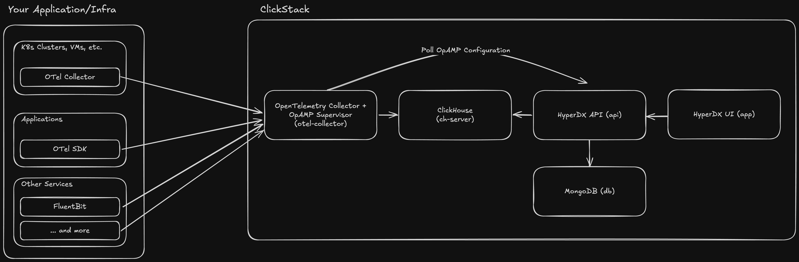

# Contributing

## Architecture Overview



Service Descriptions:

- otel: OpenTelemetry Collector, allows us to receive OpenTelemetry data from
  instrumented applications and forward it to the ingestor for futher
  processing.
- ingestor: Vector-based event pipeline that receives Otel and non-Otel events
  and parses/normalizes/forwards it to the aggregator.
- aggregator: Node.js service that receives events from the ingestor, verifies
  authentication, and inserts it to Clickhouse for storage.
- clickhouse: Clickhouse database, stores all events.
- db: MongoDB, stores user/alert/dashboard data.
- api: Node.js API, executes Clickhouse queries on behalf of the frontend.
- miner: FastAPI app serving the drain3 clustering model.
- app: Next.js frontend, serves the UI.
- task-check-alerts: Checks for alert criteria and fires off any alerts as
  needed.

## Development

You can get started by deploying a complete development stack via Docker Compose
in dev mode.

```bash
docker compose -f ./docker-compose.dev.yml up -d
```

To enable self-instrumentation and demo logs, you can set the `HYPERDX_API_KEY`
to your ingestion key (go to
[http://localhost:8080/team](http://localhost:8080/team) after creating your
account) and then restart the stack.

ex.

```sh
HYPERDX_API_KEY=<YOUR_INGESTION_API_KEY_HERE> docker compose -f ./docker-compose.dev.yml up -d
```

The core services are all hot-reloaded, so you can make changes to the code and
see them reflected in real-time.

### Windows

If you are running WSL 2, Hot module reload on Nextjs (Frontend) does not work out of the box on windows when run natively on docker. The fix here is to open project directory in WSL and run the above docker compose commands directly in WSL. Note that the project directory should not be under /mnt/c/ directory. You can clone the git repo in /home/{username} for example.

To develop from WSL, follow instructions [here](https://code.visualstudio.com/docs/remote/wsl).

## Additional support

If you need help getting started,
[join our Discord](https://discord.gg/FErRRKU78j) and we're more than happy to
get you set up!