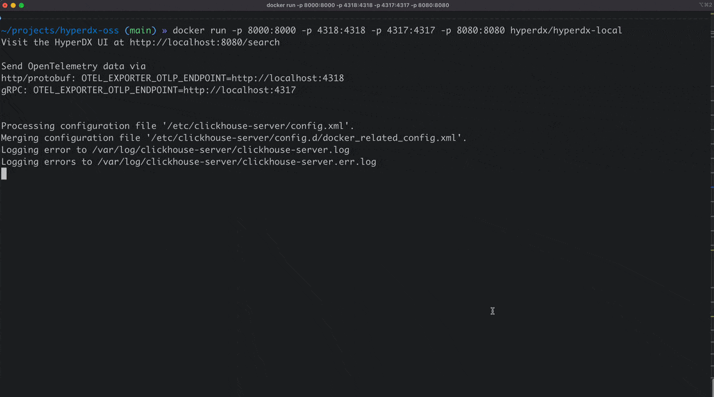

# HyperDX Local

HyperDX Local is a single container local-optimized version of [HyperDX](https://www.hyperdx.io/) that allows you to pipe OpenTelemetry telemetry (logs, metrics, traces) to a local instance of HyperDX running on your own machine. This makes it easily to debug complex applications locally using the same telemetry you have in prod or to test your instrumentation before pushing it into production.

HyperDX Local has a few additional benefits tuned to local development over the regular version:
- 📦 Packaged in a single container, to slot alongside your existing dev environment (ex. Docker Compose stack)
- 🔑 No need to auth to send and view telemetry
- 🐏 Optimized for lower memory footprint

And it has all the features you would expect from HyperDX:
- 🔭 Native OpenTelemetry logs, metrics, and traces support
- 🔍 Full text searching of logs and traces
- `{` Automatic JSON structured log parsing
- ⏱️ Application performance monitoring
- 📈 Charting logs, metrics and traces in a single UI

<br/>


## Getting Started

To get started, simply run the Docker container with the appropriate ports forwarded:

```
docker run -p 8000:8000 -p 4318:4318 -p 4317:4317 -p 8080:8080 -p 8002:8002 docker.hyperdx.io/hyperdx/hyperdx-local
```

Afterwards, you can visit `http://localhost:8080` and immediately jump into the HyperDX UI.

> We recommend having _at least_ 1GB of RAM and 1 CPU core available for the container.

## Configuring Instrumentation

Configuring instrumentation for HyperDX local is similar to configuring it for the regular open source version. You should point your OpenTelemetry instrumentation to the OpenTelemetry endpoints:

- `http://localhost:4318` for HTTP
- `localhost:4317` for gRPC

Most instrumentations can be configured using the `OTEL_EXPORTER_OTLP_ENDPOINT` environment variable. Ex: `OTEL_EXPORTER_OTLP_ENDPOINT=http://localhost:4318`.

If you're using a HyperDX maintained SDK, you may need to give a non-empty `HYPERDX_API_KEY` as well, API keys are not validated in HyperDX Local and therefore can be any non-empty value.

## Customizing Ports

If you need to customize the app (8080) or api (8000) ports that HyperDX Local runs on, you'll need to modify the `docker run` command to forward the appropriate ports and set a few environment variables.

Customizing the OpenTelemetry ports can simply be changed by modifying the port forwarding flags. Ex. Replacing `-p 4318:4318` with `-p 4999:4318` to change the OpenTelemetry HTTP port to 4999.

```bash
HYPERDX_APP_PORT=YOUR_CUSTOM_APP_PORT \
HYPERDX_API_PORT=YOUR_CUSTOM_API_PORT; \
docker run \
-e HYPERDX_APP_PORT=$HYPERDX_APP_PORT \
-e HYPERDX_API_PORT=$HYPERDX_API_PORT \
-p $HYPERDX_API_PORT:8000 \
-p 4318:4318 -p 4317:4317 \
-p $HYPERDX_APP_PORT:8080 \
-p 8002:8002 \
docker.hyperdx.io/hyperdx/hyperdx-local
```

## Open Source & Cloud Versions (Beyond Local)

If you're looking to deploy HyperDX to monitor a production environment (or anything outside your local environment), you can check out the [regular open source version](https://github.com/hyperdxio/hyperdx) or the [cloud hosted version](https://hyperdx.io/).

### Local vs Non-Local Versions

There are a few missing features in HyperDX Local compared to the other versions of HyperDX:

- HyperDX Local is single-user only (due to skipping auth)
- Has no support for [management APIs](https://www.hyperdx.io/docs/api/alerts)
- No alerting support (alerts will not fire)
- DB queries will not be reduced into query patterns
- No persistence of data (telemetry and settings) if the container is torn down 

## Notes

### Ports

- `4317` - OpenTelemetry gRPC endpoint
- `4318` - OpenTelemetry HTTP endpoint
- `8000` - Private HyperDX API for the UI
- `8002` - HyperDX HTTP Logging Endpoint
- `8080` - HyperDX UI (Next.js)

### Build Image (Only For Development)

To develop this image, you can build the image locally by running the build script from project root:

```
./docker/local/build.sh
```
