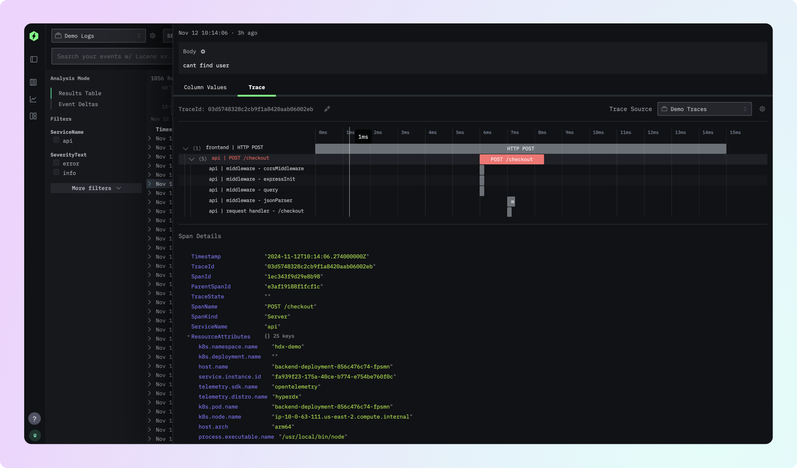
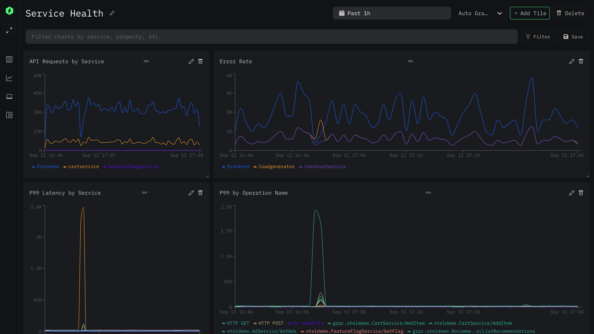
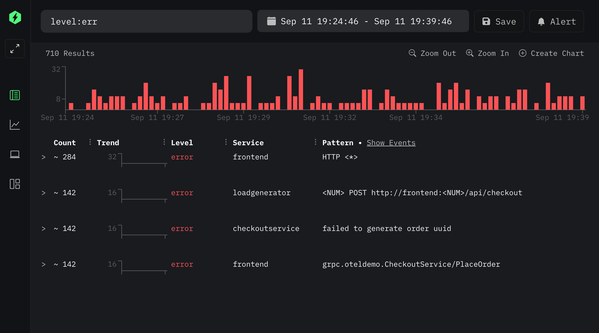
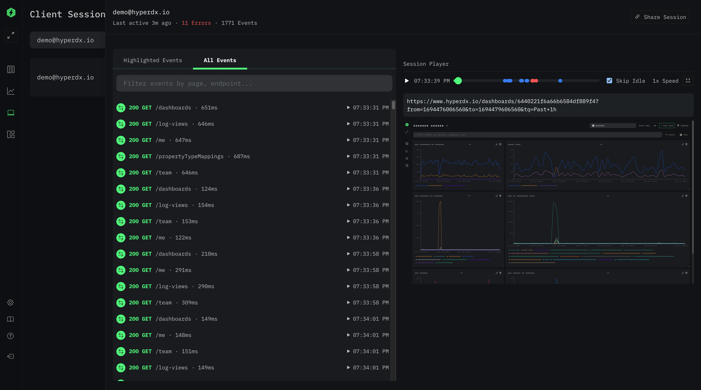

<p align="center">
  <a href="https://hyperdx.io">
    <picture>
      <source media="(prefers-color-scheme: dark)" srcset="./.github/images/logo_dark.png#gh-dark-mode-only">
      
    </picture>
  </a>
</p>

---

# HyperDX

[HyperDX](https://hyperdx.io) helps engineers figure out why production is
broken faster by centralizing and correlating logs, metrics, traces, exceptions
and session replays in one place. An open source and developer-friendly
alternative to Datadog and New Relic.

<p align="center">
  <a href="https://www.hyperdx.io/docs">Documentation</a> • <a href="https://discord.gg/FErRRKU78j">Chat on Discord</a>  • <a href="https://api.hyperdx.io/login/demo">Live Demo</a>  • <a href="https://github.com/hyperdxio/hyperdx/issues/new">Bug Reports</a> • <a href="./CONTRIBUTING.md">Contributing</a>
</p>

- 🕵️ Correlate end to end, go from browser session replay to logs and traces in
  just a few clicks
- 🔥 Blazing fast performance powered by Clickhouse
- 🔍 Intuitive full-text search and property search syntax (ex. `level:err`)
- 🤖 Automatically cluster event patterns from billions of events
- 📈 Dashboard high cardinality events without a complex query language
- 🔔 Set up alerts in just a few clicks
- `{` Automatic JSON/structured log parsing
- 🔭 OpenTelemetry native

<br/>


### Additional Screenshots

<details>
  <summary><b>📈 Dashboards</b></summary>
  
</details>
<details>
  <summary><b>🤖 Automatic Event Pattern Clustering</b></summary>
  
</details>
<details>
  <summary><b>🖥️ Session Replay & RUM</b></summary>
  
</details>

## Spinning Up HyperDX

The HyperDX stack ingests, stores, and searches/graphs your telemetry data.
After standing up the Docker Compose stack, you'll want to instrument your app
to send data over to HyperDX.

You can get started by deploying a complete stack via Docker Compose. After
cloning this repository, simply start the stack with:

```bash
docker compose up -d
```

Afterwards, you can visit http://localhost:8080 to access the HyperDX UI.

> If your server is behind a firewall, you'll need to open/forward port 8080,
> 8000 and 4318 on your firewall for the UI, API and OTel collector
> respectively.

> We recommend at least 4GB of RAM and 2 cores for testing.

**Enabling Self-instrumentation/Demo Logs**

To get a quick preview of HyperDX, you can enable self-instrumentation and demo
logs by setting the `HYPERDX_API_KEY` to your ingestion key (go to
[http://localhost:8080/team](http://localhost:8080/team) after creating your
account) and then restart the stack.

This will redirect internal telemetry from the frontend app, API, host metrics
and demo logs to your new HyperDX instance.

ex.

```sh
HYPERDX_API_KEY=<YOUR_INGESTION_KEY> docker compose up -d
```

> If you need to use `sudo` for docker, make sure to forward the environment
> variable with the `-E` flag:
> `HYPERDX_API_KEY=<YOUR_KEY> sudo -E docker compose up -d`

### Hosted Cloud

HyperDX is also available as a hosted cloud service at
[hyperdx.io](https://hyperdx.io). You can sign up for a free account and start
sending data in minutes.

## Instrumenting Your App

To get logs, metrics, traces, session replay, etc into HyperDX, you'll need to
instrument your app to collect and send telemetry data over to your HyperDX
instance.

We provide a set of SDKs and integration options to make it easier to get
started with HyperDX, such as
[Browser](https://www.hyperdx.io/docs/install/browser),
[Node.js](https://www.hyperdx.io/docs/install/javascript), and
[Python](https://www.hyperdx.io/docs/install/python)

You can find the full list in [our docs](https://www.hyperdx.io/docs).

**OpenTelemetry**

Additionally, HyperDX is compatible with
[OpenTelemetry](https://opentelemetry.io/), a vendor-neutral standard for
instrumenting your application backed by CNCF. Supported languages/platforms
include:

- Kubernetes
- Javascript
- Python
- Java
- Go
- Ruby
- PHP
- .NET
- Elixir
- Rust

(Full list [here](https://opentelemetry.io/docs/instrumentation/))

Once HyperDX is running, you can point your OpenTelemetry SDK to the
OpenTelemetry collector spun up at `http://localhost:4318`.

## Contributing

We welcome all contributions! There's many ways to contribute to the project,
including but not limited to:

- Opening a PR ([Contribution Guide](./CONTRIBUTING.md))
- [Submitting feature requests or bugs](https://github.com/hyperdxio/hyperdx/issues/new)
- Improving our product or contribution documentation
- Voting on [open issues](https://github.com/hyperdxio/hyperdx/issues) or contributing use cases to a feature request

## Motivation

Our mission is to help engineers ship reliable software. To enable that, we
believe every engineer needs to be able to easily leverage production telemetry
to quickly solve burning production issues.

However, in our experience, the existing tools we've used tend to fall short in
a few ways:

1. They're expensive, and the pricing has failed to scale with TBs of telemetry
   becoming the norm, leading to teams aggressively cutting the amount of data
   they can collect.
2. They're hard to use, requiring full-time SREs to set up, and domain experts
   to use confidently.
3. They requiring hopping from tool to tool (logs, session replay, APM,
   exceptions, etc.) to stitch together the clues yourself.

We're still early on in our journey, but are building in the open to solve these
key issues in observability. We hope you give HyperDX a try and let us know how
we're doing!

## Open Source vs Hosted Cloud

HyperDX is open core, with most of our features available here under an MIT
license. We have a cloud-hosted version available at
[hyperdx.io](https://hyperdx.io) with a few [additional features](https://www.hyperdx.io/docs/oss-vs-cloud) beyond what's
offered in the open source version.

Our cloud hosted version exists so that we can build a sustainable business and
continue building HyperDX as an open source platform. We hope to have more
comprehensive documentation on how we balance between cloud-only and open source
features in the future. In the meantime, we're highly aligned with Gitlab's
[stewardship model](https://handbook.gitlab.com/handbook/company/stewardship/).

## Contact

- [Open an Issue](https://github.com/hyperdxio/hyperdx/issues/new)
- [Discord](https://discord.gg/FErRRKU78j)
- [Email](mailto:support@hyperdx.io)

## License

[MIT](/LICENSE)
